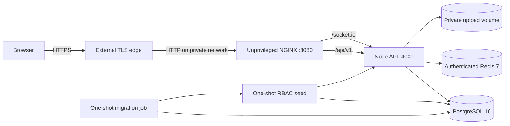

# Deployment Runbook

This runbook covers the checked-in single-host Docker Compose topology. It is a production-oriented baseline, not a substitute for organization-specific cloud, compliance, monitoring, backup, and incident-response controls.

## Topology



PostgreSQL and Redis use an internal Docker network and publish no host ports. Only NGINX publishes a port. The API and web containers run with all Linux capabilities dropped, `no-new-privileges`, and read-only root filesystems; the API receives a writable private upload volume and a temporary filesystem.

## Host requirements

- A maintained Linux host or managed container service with Docker Engine and Compose
- An HTTPS load balancer, reverse proxy, or ingress in front of NGINX
- Persistent encrypted storage and independent backup storage
- DNS for the public application origin
- SMTP credentials if verification and recovery mail must be delivered
- Central logs and external uptime/error monitoring for real operations

Do not expose ports `5432`, `6379`, or `4000` to the public Internet.

## Configure secrets

Create the ignored production file:

```bash
cp .env.production.example .env.production
chmod 600 .env.production
```

Generate independent random values. One safe generator is:

```bash
node -e "console.log(require('node:crypto').randomBytes(48).toString('base64url'))"
```

Use a different output for the PostgreSQL password, Redis password, and JWT signing secret. If a database password contains URL-reserved characters, percent-encode it in `DATABASE_URL` or generate a base64url value.

Required decisions:

| Variable            | Requirement                                                                          |
| ------------------- | ------------------------------------------------------------------------------------ |
| `APP_URL`           | Exact public HTTPS origin, with no path suffix                                       |
| `WEB_PORT`          | Host port mapped to NGINX; default is `8080`                                         |
| `POSTGRES_DB`       | Database name                                                                        |
| `POSTGRES_USER`     | Dedicated application database user                                                  |
| `POSTGRES_PASSWORD` | Unique random secret                                                                 |
| `DATABASE_URL`      | Must match the three PostgreSQL values and use host `postgres`                       |
| `REDIS_PASSWORD`    | Unique random secret                                                                 |
| `REDIS_URL`         | Must use host `redis` and contain the Redis password                                 |
| `JWT_ACCESS_SECRET` | At least 32 characters; 48 random bytes are recommended                              |
| `SMTP_*`            | Provider-specific transport values; optional only when mail delivery is not required |

Never bake these values into an image, pass them as Vite variables, store them in Git, or paste them into public CI logs. For an orchestrated production platform, inject them from its secret manager rather than a file.

## Validate and deploy

```bash
docker compose --env-file .env.production config --quiet
docker compose --env-file .env.production build --pull
docker compose --env-file .env.production up -d
docker compose --env-file .env.production ps
```

Startup order is enforced:

1. PostgreSQL and Redis become healthy.
2. The migration job applies checked-in migrations.
3. The seed job creates or updates permission and role reference data without sample accounts.
4. The API starts and its readiness probe checks both dependencies.
5. NGINX starts after the API becomes ready.

Verify from outside Docker:

```bash
curl --fail --silent --show-error http://127.0.0.1:8080/healthz
curl --fail --silent --show-error http://127.0.0.1:8080/api/v1/health/ready
curl --head --fail http://127.0.0.1:8080/
```

The API payload wraps readiness data in `data`; both `data.checks.database` and `data.checks.redis` must be `ok`. The HTML response must include the configured Content Security Policy and other security headers.

## TLS and proxy behavior

The included NGINX listens on unprivileged port `8080` and expects an external HTTPS edge. Configure that edge to:

- redirect HTTP to HTTPS;
- forward the original host and protocol;
- support WebSocket upgrades on `/socket.io/`;
- use a maintained TLS policy and automatic certificate renewal;
- limit requests before they reach the host when practical.

Set `APP_URL` to the browser-visible HTTPS origin. The API trusts only loopback, link-local, and unique-local proxy addresses in the supplied Compose topology. Do not change `TRUST_PROXY` to `true` or `*`.

NGINX applies an 11 MB request limit, immutable caching for hashed assets, no-cache for the SPA shell, SPA history fallback, gzip, CSP, frame denial, referrer restrictions, permissions restrictions, and content-type sniffing protection. Express adds Helmet headers and application-level CORS/CSRF controls to API responses.

## Logs and health

```bash
docker compose --env-file .env.production logs --tail=200 api web
docker compose --env-file .env.production ps
```

Application logs are structured JSON in production and carry request IDs. Do not enable request-body logging. Tokens, cookies, authorization headers, passwords, and SMTP/database secrets must not be logged.

Probe meanings:

- `/health`: the Node process and event loop are alive.
- `/health/ready`: PostgreSQL and Redis are reachable.
- `/healthz`: NGINX is serving.

An external monitor should probe the public readiness route and a synthetic authenticated flow. Container health alone does not prove that DNS, TLS, email, disk capacity, or browser behavior is healthy.

## Backup and restore

Back up these resources as one recovery set:

1. PostgreSQL data.
2. The private upload volume.
3. Deployment configuration excluding plaintext secrets from general archives.

Define recovery point and recovery time objectives, encrypt backups, store them outside the host, restrict access, test restoration regularly, and document the result.

Before a restore:

1. Stop API writes or enter a maintenance window.
2. Verify the target environment and backup checksum.
3. Restore PostgreSQL and uploads from the same logical point.
4. Apply any migrations required by the deployed application version.
5. Start services and verify health plus authenticated file access.

Never test restoration over the only production copy.

## Upgrade and rollback

Before an upgrade:

1. Read `CHANGELOG.md` and migration SQL.
2. Back up the database and uploads.
3. Build immutable version-tagged images.
4. Run CI and a staging smoke test.
5. Apply backward-compatible migrations before replacing API instances.

Rollback application images only when the older code is compatible with the migrated schema. A database rollback is a separate, high-risk recovery operation and must use a tested plan; Prisma migration history must not be manually rewritten in production.

## Scaling notes

The Socket.IO Redis adapter publishes authorized room events and computes presence across API instances. This permits multiple API replicas on a shared network without losing realtime fan-out.

The checked-in `LocalStorageService` writes private files to a filesystem volume. Multiple containers on one host may share that volume, but multi-host or autoscaled deployment requires an object-storage implementation with equivalent tenant authorization, content validation, and private download behavior. PostgreSQL and Redis should also move to managed/high-availability services before claiming high availability.

When adding replicas, configure the edge for WebSocket support and, if long-polling remains enabled, sticky sessions. Validate disconnect/reconnect behavior, presence, rate limits, and rolling upgrades under load.

## Incident response basics

- Revoke affected sessions and rotate exposed credentials immediately.
- Preserve structured logs and request IDs without copying sensitive request data.
- Take compromised hosts out of rotation instead of modifying evidence in place.
- Determine tenant impact before notifying users.
- Patch, test, deploy, and document the root cause.
- Report security issues through the process in [SECURITY.md](../SECURITY.md).

## Shutdown

Stop containers while preserving volumes:

```bash
docker compose --env-file .env.production down
```

Do not add `--volumes` on a system containing real data. That flag deletes the Compose-managed PostgreSQL, Redis, and upload volumes.
