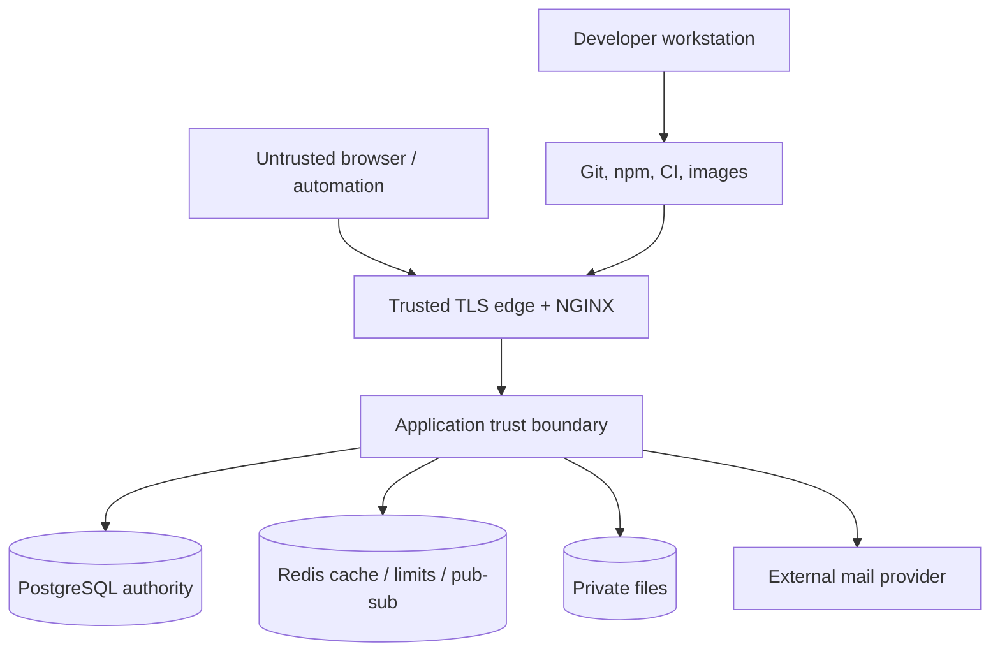

# Orbit Threat Model

Threat model updated: 2026-08-23

## Scope

The model covers the browser application, REST API, Socket.IO transport, PostgreSQL, Redis, private files, SMTP boundary, NGINX edge, CI, container images, and environment secrets.

Protected assets include credentials, sessions, organization data, roles, projects, tasks, comments, notifications, files, audit records, email tokens, tenant membership, and service availability.

## Trust boundaries

Every value crossing from the browser, email link, WebSocket, upload, proxy header, environment, external dependency, or stored user content is untrusted until validated for its use.

## Actors

- Anonymous user or automated scanner
- Authenticated user with no membership in a target tenant
- Viewer, developer, or manager attempting a higher-role action
- Malicious owner/admin attempting to affect another tenant
- User controlling IDs, bodies, queries, headers, filenames, MIME, URLs, or socket events
- Attacker holding an expired, modified, stolen, replayed, or revoked token
- Credential-stuffing, brute-force, recovery, invitation, search, upload, or WebSocket automation
- Compromised dependency, CI token, container registry, SMTP account, or operator workstation
- Infrastructure operator with database, volume, log, or secret access

## Security invariants

1. A request must not derive identity, tenant, role, or membership from untrusted client claims.
2. A member of organization A must not read or mutate organization B resources by changing an identifier.
3. Client-visible controls are UX only; authorization is repeated in the API and socket subscription path.
4. Passwords, refresh/reset/verification material, cookies, signing secrets, and infrastructure credentials must not appear in source, normal responses, or logs.
5. Private file bytes require authentication plus resource membership and must remain outside public static paths.
6. Single-use credentials must remain single-use under concurrent requests.
7. Search, analytics, pagination, filters, ordering, uploads, and WebSockets must be bounded against abuse.
8. Production failures expose a correlation ID and safe message, not internal implementation data.

## Threats and controls

| Threat                             | Primary controls                                                                                                                        | Verification                                                                    |
| ---------------------------------- | --------------------------------------------------------------------------------------------------------------------------------------- | ------------------------------------------------------------------------------- |
| Authentication bypass / forged JWT | Explicit HS256 verification, required claims/type, expiration, strong environment secret                                                | Missing, invalid, modified, wrong-algorithm/signature tests                     |
| Credential stuffing / brute force  | bcrypt, generic errors, Redis login/register/recovery buckets                                                                           | Rate-limit and enumeration tests                                                |
| Refresh theft/replay               | `HttpOnly` path cookie, rotation, hashed tokens, session/family revocation, TTL                                                         | Revoked/reused/expired refresh tests                                            |
| Reset/verification replay          | Hashed expiring token, atomic consume, generic recovery response                                                                        | Concurrent double-consume tests                                                 |
| CSRF                               | Exact origin allowlist, CSRF token contract, `SameSite=Lax`, credentialed CORS                                                          | Missing/wrong token and origin scenarios                                        |
| Session fixation/hijack            | New random session/refresh material, rotation, logout/all, password reset revocation, secure production cookie                          | Auth integration tests                                                          |
| BOLA/IDOR / tenant leak            | Resource-to-tenant resolution, membership middleware, scoped repositories, not-found behavior                                           | User A / tenant B tests across resources, search, analytics, files, sockets     |
| Privilege escalation               | Server-side permission catalog and operation-specific middleware                                                                        | Viewer/developer administrative-action tests                                    |
| Mass assignment                    | Strict operation-specific Zod DTOs                                                                                                      | Unknown role/owner/sensitive field rejection                                    |
| SQL injection / filter abuse       | Prisma parameters, parameterized SQL, allowlisted types/filters, escaped search wildcards                                               | Injection-like and wildcard tests                                               |
| Stored/reflected/DOM XSS           | React escaping, React Markdown without raw HTML, CSP, URL/file validation                                                               | Malicious text payload and Axe/browser flows                                    |
| Malicious upload / path traversal  | Memory limits, allowlists, signatures/decoding, active-content checks, randomized keys, root/symlink validation, authenticated download | Oversize, invalid MIME/signature, active content, traversal, cross-tenant tests |
| WebSocket room bypass              | JWT handshake, strict UUID schema, DB membership check, derived room names, subscription caps/rates                                     | Unauthorized room/action and two-node tests                                     |
| CORS/proxy abuse                   | Explicit origins, credential mode, wildcard rejection, explicit trusted proxy ranges                                                    | Config and integration tests                                                    |
| Sensitive error/log disclosure     | Central error mapper, production stack suppression, Pino redaction/avoidance, request IDs                                               | Error/config/logger tests and code review                                       |
| Race/TOCTOU                        | Database constraints, transactions, row locks, atomic token operations                                                                  | Token and time-tracking concurrency tests                                       |
| Availability abuse                 | JSON/upload limits, bounded pages/search/analytics, Redis limits, NGINX body cap, health checks                                         | Pagination/size/rate-limit tests                                                |
| Supply-chain compromise            | Lockfile, `npm ci`, audit gate, Dependabot, secret scan, production image build                                                         | CI jobs on push/PR                                                              |
| Audit tampering                    | Audit writes occur server-side and normal users receive no mutation endpoint                                                            | Service/integration audit assertions                                            |

## Abuse cases

### Cross-tenant task or file access

An attacker changes a task, attachment, board, label, comment, project, or organization ID. The API resolves the target back to its organization/project and applies membership plus permission. A mismatch is rejected without exposing the target content.

### Invitation enumeration or theft

An attacker submits guessed/replayed invitation tokens or floods invitations. Tokens are random, expiring, revocable, rate-limited, tied to invitation state/email behavior, and delivered through mail rather than a list response. Acceptance still requires an authenticated account.

### Socket eavesdropping

An attacker connects with a valid low-privilege token and requests another project room. The server validates the project UUID and queries membership before `join`; the client cannot choose a raw room string. Redis propagates only server-authorized room traffic.

### File polyglot or active content

An attacker lies about MIME, extension, or content. The service applies layered validation and never executes files. Downloads remain authenticated. Environments with a broad external threat surface should additionally quarantine and malware-scan files.

### Stored content injection

An attacker stores script-like text in names, descriptions, comments, or labels. React treats it as text, Markdown does not enable raw HTML, CSP blocks inline script execution, and API schemas bound length/shape. Future rich-text plugins require a new threat review.

### Rate-limit bypass behind a proxy

An attacker spoofs forwarding headers to obtain new IP buckets. Express trusts only the configured proxy allowlist, never all proxies. The production topology passes forwarded headers from a private NGINX hop, and sensitive authenticated buckets can use user identity.

## Residual threats

- A successful same-origin XSS could read the in-memory access token; CSP, safe rendering, short access TTL, and revocation reduce but do not eliminate impact.
- A host/storage administrator can access database and volume contents; infrastructure access control and encryption are operator responsibilities.
- Local storage has no bundled malware engine and is not appropriate for multi-host replication.
- Redis/PostgreSQL failure in the supplied single-host topology affects availability.
- New dependency advisories and unknown vulnerabilities can appear after audit time.
- Business-level misuse by a legitimate organization owner requires audit review and product governance rather than tenant access controls alone.

## Review triggers

Repeat threat modeling when adding OAuth/SSO, public links, webhooks, HTML/rich-text rendering, third-party integrations, billing, object storage, mobile clients, custom roles, data export, AI features, multi-region infrastructure, or a new category of uploaded file.
