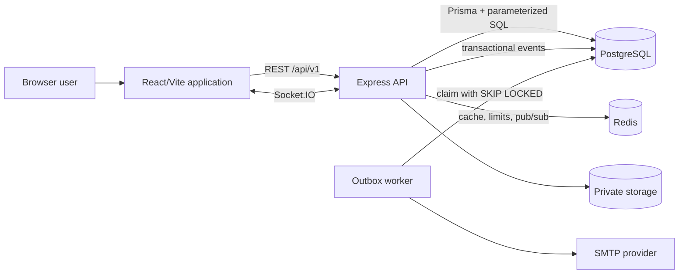
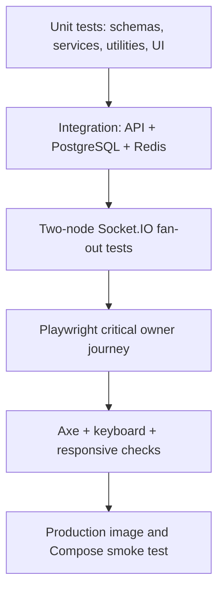

# Orbit Architecture

## System context

Orbit is a TypeScript monorepo with a browser client, an HTTP/WebSocket API, PostgreSQL, Redis, and private file storage.



The browser is never a security boundary. It may hide unavailable actions for usability, but the API repeats identity, tenant, membership, resource, and permission checks.

## Monorepo boundaries

- `apps/web`: routes, layouts, pages, feature API clients, query hooks, stores, localization, and UI primitives.
- `apps/api`: configuration, shared infrastructure, feature modules, Prisma schema/migrations, HTTP composition, and Socket.IO.
- `packages/shared`: strict external schemas, API DTO types, permissions, locale types, and realtime event contracts.
- `packages/tsconfig`, `eslint-config`, and `prettier-config`: repository-wide engineering rules.

The web application does not import API internals. Both applications depend on `@orbit/shared`, keeping wire contracts in one place.

## API module structure

Each feature follows a pragmatic layered design:

```text
request
  -> global middleware
  -> authentication
  -> tenant/resource membership
  -> permission check
  -> strict validation
  -> controller
  -> service
  -> repository
  -> PostgreSQL/storage/realtime/mail
```

- Routes compose middleware and declare transport behavior.
- Controllers translate HTTP input and output without owning domain decisions.
- Services enforce business invariants and coordinate transactions or side effects.
- Repositories contain Prisma and SQL access.
- Infrastructure interfaces isolate mail, storage, cache, rate limiting, auditing, and realtime publication.

Feature modules include authentication, users, organizations, projects, boards, tasks and task resources, comments, notifications, search, analytics, health, documentation, and realtime authorization.

Authentication and invitation emails use an encrypted transactional outbox. The domain token and its delivery event commit together. A separate worker claims bounded batches with PostgreSQL row locks, retries with exponential backoff, recovers stale leases, and redacts stored provider failures. Delivery is at least once: an SMTP provider can accept a message immediately before a worker crash, so operators should expect rare duplicate transactional emails.

## Frontend architecture

React Router owns public, authentication, and protected application routes. Protected routes restore the session before rendering the app shell. TanStack Query owns server state, caching, invalidation, and mutation lifecycles; Zustand holds small client-only state such as authentication/session presentation. Forms use React Hook Form with the same Zod contracts shared with the API where appropriate.

Route-level code splitting keeps large authenticated pages and analytics charts out of the initial public bundle. Vite creates stable vendor groups for React, data, forms, UI, and localization dependencies. Realtime hooks reconcile Socket.IO domain events into TanStack Query caches rather than maintaining a second authoritative entity store.

UI copy lives in locale catalogs for `en`, `es`, `fr`, and `pt-BR`. The selected locale is resolved from an authenticated account preference, then safe browser storage, then browser preference, with English as fallback.

## Data and tenancy

`Organization` is the tenant aggregate root. Membership and permission context is resolved before repositories return tenant-owned resources. Project, board, task, comment, label, file, search, and analytics paths are scoped through organization ownership.

The schema uses UUIDs, foreign keys, composite uniqueness, soft deletion where domain recovery matters, and indexes for frequent filters. Concurrency-sensitive token and time-tracking flows use atomic updates, constraints, locks, and transactions.

See [DATABASE.md](DATABASE.md) for the complete model groups and migration policy.

## Authentication and request security

1. Registration or login returns a short-lived access token to application memory and sets a rotating refresh token in a path-restricted `HttpOnly`, `SameSite=Lax` cookie.
2. The client sends the access token as a bearer credential.
3. Refresh rotation revokes the previous token and detects invalid/reused material.
4. Logout revokes the current session; logout-all revokes other sessions.
5. Verification and reset tokens expire and can be consumed only once.
6. State-changing requests require an allowed origin and the CSRF token contract.

Global middleware adds request IDs, structured redacted logging, Helmet, an explicit CORS allowlist, a 1 MB JSON limit, cookie parsing, global rate limiting, CSRF validation, not-found handling, and safe centralized errors.

## Realtime architecture

Socket.IO authenticates the handshake with the same signed access token model. A socket may join only a project room authorized by a repository-backed membership check. Subscription payloads are strict, subscriptions and event rates are bounded, arbitrary room names are never accepted, and per-user notification rooms derive from the verified identity.

The Redis adapter fans events across API processes. Presence is calculated from sockets across the adapter rather than a process-local map. Project mutations publish typed invalidation events; the client refreshes only affected query families and recovers after reconnect.

## Files

Files are never exposed through a public static directory. The storage service accepts only opaque relative keys, resolves paths under a configured root, rejects absolute/traversal/symlink escapes, and returns bytes through authenticated controllers. Avatar images are decoded and normalized; task attachments enforce size, allowed MIME, filename handling, content signatures, and additional active-content checks.

The Compose deployment uses a private volume. Multi-host deployments must supply a shared object-storage implementation without weakening authorization.

## Observability and operations

- Pino JSON logs in production with request correlation IDs and sensitive-header redaction
- `/health` liveness and dependency-aware `/health/ready`
- Dependency connection retries and graceful `SIGINT`/`SIGTERM` shutdown
- Encrypted transactional email outbox with a separately scalable worker
- Durable `AuditLog` entries for sensitive security and administrative actions
- Domain activity streams for user-visible project/task history
- Docker health checks and startup dependency ordering

Metrics and hosted error tracking are integration points, not bundled vendor services. Operators must add external monitoring appropriate to their environment.

## Production topology

NGINX serves static assets and the SPA, applies browser security headers, proxies `/api/` and `/socket.io/`, supports WebSocket upgrades, and limits upload size. The API runs as a non-root Node user; NGINX uses an unprivileged image. PostgreSQL and authenticated Redis are reachable only on an internal network. Migration and RBAC seed jobs must complete successfully before the API starts.

See [DEPLOYMENT.md](DEPLOYMENT.md) for the operational runbook.

## Testing strategy



Security assertions include anonymous access, tenant crossing, role escalation, invalid/forged/expired/revoked tokens, single-use token races, CSRF/CORS, unsafe uploads, pagination bounds, injection-like inputs, unauthorized realtime rooms, and cross-node event delivery.

## Design constraints

- Local file storage limits multi-host scaling until replaced.
- Email behavior requires a real SMTP provider for production delivery.
- Analytics are operational delivery metrics, not an immutable data warehouse.
- The checked-in production configuration is a single-host baseline, not a claim of automatic high availability.
