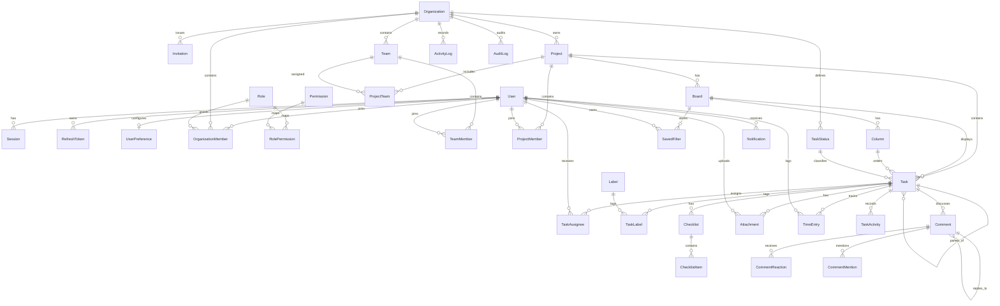

# Orbit Entity Relationship Summary

The authoritative model is `apps/api/prisma/schema.prisma`. This diagram shows aggregate ownership and the primary many-to-many joins without repeating every scalar field.

## Key invariants

- Organization membership is the root authorization context.
- Project membership can further constrain project access but cannot grant access across organizations.
- Board/column/task relations are validated together so a task cannot be moved into a column from another board or project.
- A task may have a parent task in the same project, enabling subtasks.
- Checklists are first-class task children; checklist items belong to one checklist.
- Saved filters are personal even when their target board is shared.
- Refresh, verification, reset, and invitation secrets are stored as hashes where the flow permits and have expiration/revocation state.
- Audit records preserve historical actor identifiers rather than cascading away the evidence.

See [DATABASE.md](DATABASE.md) for migration, concurrency, backup, and performance policy.
